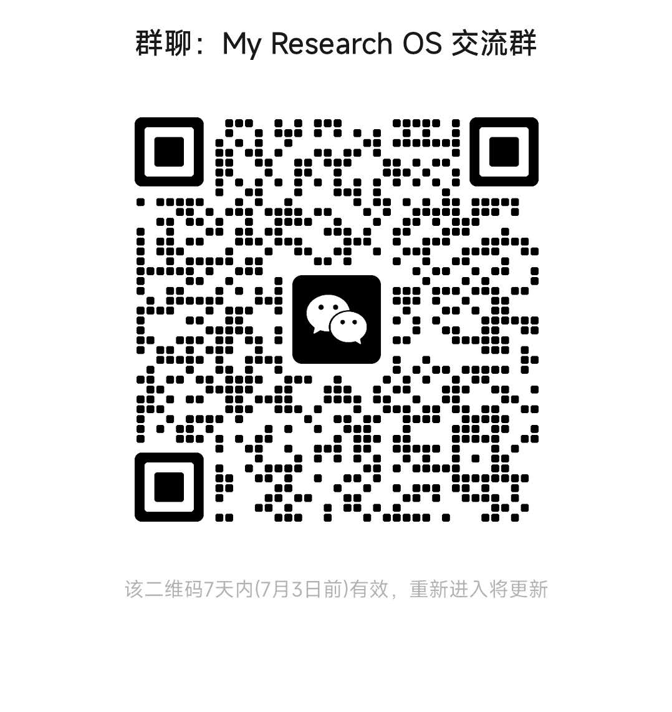

 

  

**Turn the best research engineering out there into your own capability.**

&nbsp;·&nbsp; **English** ·&nbsp; [中文](./README.md)

---

> Every day we curate useful academic AI tools from GitHub, sorted by research stage; then a five-layer framework welds them into your own research pipeline.
> **Live board → https://dalaoyuan2020.github.io/research-os/**

## Why

I'm **Lyu Zhiyuan**, a student at Hohai University. This project started from something that puzzled me.

I introduced Claude Code to people around me and walked them through it. But after a while, they didn't seem all that moved, and didn't change much. Meanwhile, I felt myself getting noticeably stronger almost every week.

Same tool — so why the gap?

I thought about it for a long time. Maybe I just wasn't watching closely enough, and they were changing too. But I think the real reason is *how* we used it.

Most people treat AI as a "solver": ask a question, take the answer, close the tab — the problem is solved, but the person stays the same. I do one extra thing every time: I read how the answer was actually reasoned out, pull out the one part worth keeping, and turn it into something I can use next time. After each problem I'm a little stronger than before — and that compounds.

I came to call this **"Resource-Language Programming."** GitHub is the world's best open-source engineering library; in the agent era, *being able to read and absorb that engineering into your own capability is itself a form of programming.*

Research OS makes this **discover → absorb → internalize → self-strengthen** loop public — and looks for like-minded people to grow it together.

## What it is

Three layers, from "shared by everyone" to "my own practice":

| | What | For whom |
|---|---|---|
| **① Foundation** | A leaderboard of academic AI tools, curated daily, sorted by stage | Everyone doing research — a common starting point |
| **② Framework** | Research OS, five layers — welding scattered tools into a pipeline | Anyone building their own research system |
| **③ Cases** | From an idea to a submitted paper | Anyone who wants to see it actually work |

---

## ① Foundation · Academic AI Tool Leaderboard

A daily-curated, stage-sorted, readable & filterable board that links straight to each repo — the common starting point for everyone.

- 🌐 **Live**: https://dalaoyuan2020.github.io/research-os/
- **24+** tools, **110k+** combined stars, sorted into `ideation / experiment / writing / general`
- An interactive **Skill orbit** on the homepage: node size = popularity, color = stage, click to open the repo
- Not "yet another awesome list" — each tool is tagged with **the one thing most worth learning from it**

See [`docs/how-the-board-works.md`](./docs/how-the-board-works.md).

## ② Framework · Research OS, five layers

| Layer | Role | What it does |
|---|---|---|
| **L1 Reading** | read | literature search, structure parsing, quick-read cards |
| **L2 Knowledge** | distill | cross-paper knowledge network (Karpathy-Wiki-style backlinks) |
| **L3 Writing** | write | revision version control, mock peer review, citations, de-AI-ifying, figures |
| **L4 Auto-research** | verify | experiment harness, self-iteration loop |
| **L5 Project mgmt** | manage | multi-project board, progress control, orchestration |

The loop: **read → distill → write → verify → manage**. The system keeps absorbing good engineering from the board and iterating on itself. Details in [`docs/five-layers.md`](./docs/five-layers.md).

## ③ Case · From an idea to a paper

- **An idea**: "can this prediction task be more accurate and more convincing?"
- **Collect**: literature search + analysis, benchmarking the target journal's real conventions
- **Orchestrate**: revision version control + mock peer review + de-AI-ifying, woven into one revision loop
- **Result**: pick the most robust method by data, revise into a submittable paper

Full write-up: [`docs/cases/from-idea-to-paper.md`](./docs/cases/from-idea-to-paper.md).

---

## 🧭 How to use it

1. **Browse the board** → open the [live site](https://dalaoyuan2020.github.io/research-os/), filter by your current stage, jump into repos.
2. **Don't stop at "using"** → pick one, read its engineering, extract the core, make it your own. That's the point.
3. **Build your own** → use the [five-layer framework](./docs/five-layers.md) to weld your tools into a pipeline.

## 🤝 Contribute

This isn't one person's bookmark folder.

- **Found a great academic AI tool?** Open an [Issue](https://github.com/Dalaoyuan2020/research-os/issues/new) — repo link + one-line value + which stage.
- **Too lazy to type?** Let your **AI agent open the issue for you** (we're agent-friendly — see [CONTRIBUTING.md](./CONTRIBUTING.md)).
- **Want to co-create** (framework / cases / stages)? Also in [CONTRIBUTING.md](./CONTRIBUTING.md).

Accepted tools enter the board with attribution.

## 🫂 Community

<table>
<tr>
<td align="center"> "My Research OS" group · 7-day link, add the author if expired</td>
<td align="center"> Author's WeChat · Sheep_珐德</td>
</tr>
</table>

## 🗺️ Roadmap

- [x] Academic AI tool leaderboard live (24+ tools, four stages)
- [x] Draggable Skill orbit + self-looping discovery engine
- [ ] Open-source the five-layer framework into `docs/`
- [ ] Expand the case library (beyond idea-to-paper: experiments, surveys)
- [ ] Co-creator wall of attribution

## ⭐ Star History

## License

[MIT](./LICENSE) · © 2026 Lyu Zhiyuan (Dalaoyuan2020)

Tools come and go. "Turning others' best engineering into your own capability" doesn't.

